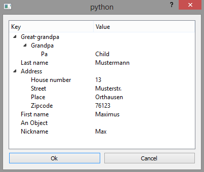

# Edit Dictionaries in a TreeView using PySide / PyQt
## Content
+ DictionaryTreeModel: Data model class (QAbstractItemModel) for use by a QTreeView.
+ DictionaryTreeWidget: Can be used as widget in any application.
+ DictionaryTreeDialog: Simple dialog in "guidata" manner.

## Example
<pre><code>
d = {'First name': 'Maximus',
     'Last name': 'Mustermann',
     'Nickname': 'Max',
     'Address':{
         'Street': 'Musterstr.',
         'House number': 13,
         'Place': 'Orthausen',
         'Zipcode': 76123},
     'An Object': float,
     'Great-grandpa':{
         'Grandpa':{
             'Pa': 'Child'}}
}

print(d)
{'Great-grandpa': {'Grandpa': {'Pa': 'Child'}},
'Last name': 'Mustermann', 'Address':
{'House number': 13, 'Place': 'Orthausen', 'Zipcode': 76123,
'Street': 'Musterstr.'}, 'First name': 'Maximus',
'An Object': <type 'float'>, 'Nickname': 'Max'}

tree = DictionaryTreeDialog(d)
tree.edit()
</code></pre>

This will pop up:

The edited dictionary is retrieved by:
<pre><code>
edited_dict = tree.to_dict()
</code></pre>

Comment: 2013.12.10, is in development status, some stuff wont work
